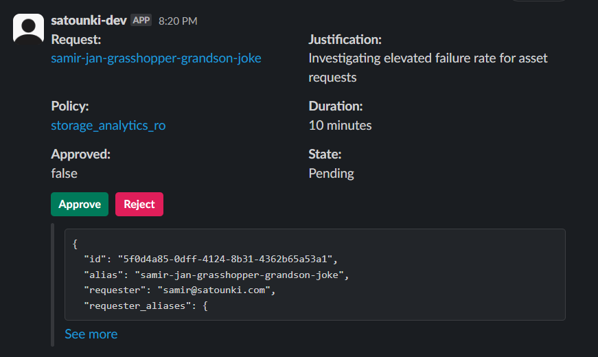
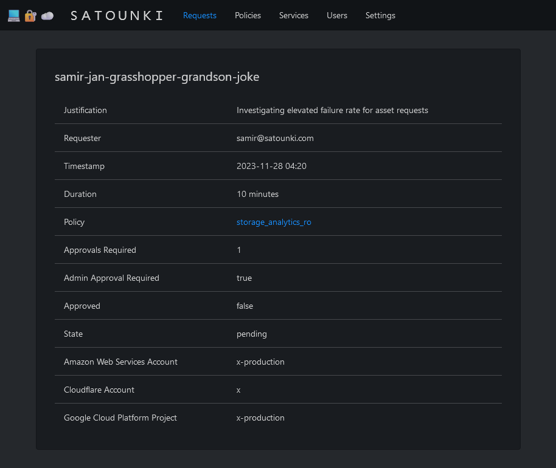

# 💻🔐☁️ S A T O U N K I

Temporary elevated access management as a self-hosted service

## Overview

Satounki is a self-hosted service which brings visibility, order and auditability to temporary elevated access
requests, augmenting a traditional organizational least-privilege permissions approach with the ability to
elevate permissions in a structured way in exceptional circumstances such as incident investigation and response.

Satounki is composed of a self-hosted service to handle requests, a self-hosted client worker to action and revoke
requests, a CLI for handling access requests, a Slack bot for notifications, approving, or rejecting access requests,
and a UI to explore policies and request history.

### Configuration

Once deployed, Satounki can be configured via Terraform or API directly to configure cloud provider accounts and
policies across them:

```terraform
provider "satounki" {
  base_url  = "https://satounki.yourcompany.com/v1"
  api_token = "e-mo-tion"
}

resource "satounki_aws_account" "aws" {
  for_each                = toset(["x-development", "x-production"])
  account                 = each.value
  approvals_required      = 1
  admin_approval_required = replace(each.value, "production", "") != each.value
}

resource "satounki_gcp_project" "gcp" {
  for_each                = toset(["x-development", "x-production"])
  project                 = each.value
  approvals_required      = 1
  admin_approval_required = replace(each.value, "production", "") != each.value
}

resource "satounki_cloudflare_account" "cloudflare" {
  account                 = "x"
  approvals_required      = 1
  admin_approval_required = false
}

resource "satounki_policy" "storage_analytics_ro" {
  name        = "storage_compute_analytics_ro"
  description = "Read only access to Storage on GCP and AWS, and Analytics on Cloudflare"
  gcp = [
    "roles/storage.objectViewer",
  ]
  aws = [
    "arn:aws:iam::aws:policy/AmazonS3ReadOnlyAccess"
  ]
  cloudflare = [
    "Analytics"
  ]
}
```

The roles of users, request approvers and administrators can similarly be configured via Terraform or API.

### Usage

Satounki has a CLI that is used to request access to any of the polices defined on the service.

```shell
export SATOUNKI_USER_TOKEN=samirs-user-token
satounki request storage_analytics_ro --minutes 10 --aws-account x-production --gcp-project x-production --cloudflare-account x

# $EDITOR opens here to the user write a justification for this request

# view details       satounki describe-request "samir-jan-grasshopper-grandson-joke"
# approve request    satounki approve-request "samir-jan-grasshopper-grandson-joke"
# cancel request     satounki cancel-request "samir-jan-grasshopper-grandson-joke"
# complete request   satounki complete-request "samir-jan-grasshopper-grandson-joke"
```

Approvers and admins can approve the request either by using the CLI, or interacting with the Satounki bot on Slack.



The requesting user can also opt to cancel the request before it is approved, or "complete" the request early after
access is granted if it is not needed for the remainder of the duration requested.

The Satounki UI can also be used to inspect requests.



### Supported Services

Satounki currently supports the following services:

- Amazon Web Services
- Google Cloud Platform
- Cloudflare

## Current State, Tentative Future Roadmap

While Satounki is currently in a functional state, there are no documented steps for deployment and I don't recommend
that anyone use this software for anything mission-critical just yet.

If you would like to get involved in an open source Rust project, I would welcome your collaboration on Satounki!

If you are still exploring an interest in Rust and do not yet feel comfortable contributing, you can also help this
project with skills you may have in **Go** and **Typescript** by providing feedback on the Go and Typescript API client
libraries which are automatically generated from the Rust code.

Some of the next areas that I would like see being worked on include:

- [ ] Support for other login providers besides Google
- [ ] Get the Satounki service published in Nixpkgs in 24.05 (hopefully)
- [ ] Publishing Helm Charts and Kustomize templates for Kubernetes deployments
- [ ] Support for Azure
- [ ] Generate HTML reference documentation
- [ ] Support for registering custom roles and policies to be used in Satounki policy definitions
- [ ] Bots for Discord, Microsoft Teams and other team-chat services which can be used to approve or reject requests
- [ ] Generation of Pulumi providers in Typescript and Go (maybe Python too?)
- [ ] Improving the Terraform provider documentation and getting the provider published
- [ ] Setting up a collaborative development/staging environment for contributors
- [ ] Setting up issue and contribution templates/standards/checks on GitHub
- [ ] Add conditions for automatic approvals on a Satounki policy

I'm sure that there are as many ideas for a project like this as there are companies, teams and people; if you have an
idea that you think would be a good fit for this project, I am always open to hearing it out.

## Development

The dependencies required for developing on this project are handled by [Nix](https://nixos.org). The repository has
a [`shell.nix`](shell.nix) file integrated with `direnv` to make onboarding as painless as possible.

Before getting started you should create a `.env` file in the repository root following the format given below.

```shell
DATABASE_URL="dev.db" # this defaults to dev.db anyway if not set
GOOGLE_CLIENT_ID=xxx
GOOGLE_CLIENT_SECRET=xxx
SECRET_KEY=hey-i-just-met-you-and-this-is-crazy-but-heres-my-number-so-call-me-maybe
SLACK_CLIENT_ID=xxx
SLACK_CLIENT_SECRET=xxx
SLACK_SIGNING_SECRET=xxx
SATOUNKI_URL=http://localhost:8080 # this defaults to http://localhost:8080 anyway if not set
SATOUNKIPLATFORM_API_TOKEN=e-mo-tion # if this value is set, it will be saved to the db instead of a generated value
SATOUNKI_API_TOKEN=e-mo-tion # this is set when loading dev_data.sql
SATOUNKI_USER_TOKEN=crj # this is set when loading dev_data.sql
SATOUNKI_WORKER_KEY=swk-e0c43bd0-38a4-4e7b-9c0f-8bd5f47f20d2 # this is set when loading dev_data.sql
```

- The `GOOGLE_CLIENT_*` values are only required if you want to work on the login feature or work on the UI
  - A free [Google Workspace Essentials Starter](https://workspace.google.com/essentials/) account can be used to
    generate an oauth2 client id in the [Google API Console](https://console.cloud.google.com/apis/credentials) to
    populate these fields; just make sure you set the redirect url to `http://localhost:8080/redirect/google` (or a
    FQDN if you're using something like Cloudflare Tunnels)
- The `SLACK_CLIENT_*` values are only required if you want to work on the Slack bot
  - Make sure to set a redirect url using a FQDN eg. `https://dev.satounki.com/redirect/slack`
  - You can create a new app on the [Slack API dashboard](https://api.slack.com/apps), making sure to enable the following bot token scopes:
    - `chat:write`
    - `incoming-webhook`
    - `users:profile:read`
    - `users:read`
    - `users:read:email`
- The `SATOUNKI*` values in the example are the ones set if you load `sqlite3 dev.db < dev_data.sql`

**Note: You do not need to create a Google oauth2 client or a Slack bot to start hacking on the API code!**

### Quickstart

With the `.env` file in place, you have everything you need to get started

- `direnv allow` to load the shell and generate a `process-compose.yaml` file
- `cargo check` once just to make sure nothing is broken
- `just start` to start the `api` backend and the `client` worker
- `sqlite3 dev.db < dev_data.sql` to load some predictable dev data as mentioned above
- `just tf` to generate the Terraform provider code and initialize the projects in `./terraform`
- `cd terraform/platform` and `terraform apply` to create a company (modify as you see fit)
  - `terraform import satounkiplatform_company.satounki 1` if you're using `dev_data.sql`
- `cd terraform/company` and `terraform apply` to create some accounts and policies in that company (modify as you see
  fit)
- `just satounki [user token (crj and smr are in dev_data.sql)] [command]` to start sending requests via the CLI
- If you have set up the `GOOGLE_CLIENT_*` variables you can head to `http://localhost:8080/login/google` to sign in to
  the UI
- If you want the local worker to run against live cloud services, modify `client/src/configuration.yaml` accordingly

### Code Standards

These will evolve as time goes on and suggestions are always welcome.

- Commit messages should follow the [Commitizen](https://github.com/commitizen/cz-cli) format
  e.g. `feat(cli): imperative description` to make for easier and more consistent changelog generation
- Make sure to run `just fmt` before committing code
- If you want to add an `#[allow(clippy::lint_name)]` annotation in the codebase please provide clear a justification
